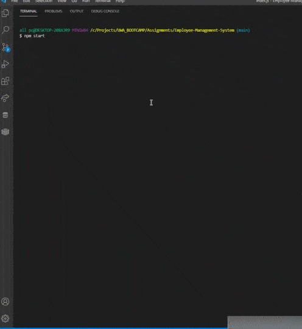
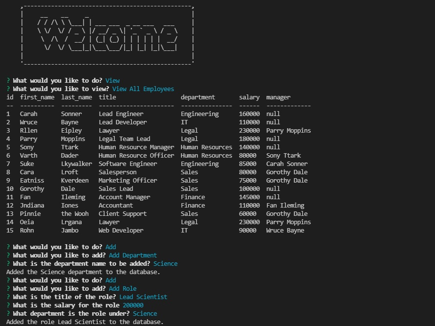

# Employee Management System

[](https://opensource.org/licenses/MIT)

## Description

An application to manage the departments, employees and roles within a company.

The application uses the console.table, dotenv, inquirer, and mysql2 package modules.

## 📖Table of Contents
1. [Installation](#installation)
2. [Usage](#usage)
3. [Assets](#assets)
4. [Technologies](#Technologies)
5. [License](#license)
6. [Contributing](#contributing)
7. [Tests](#tests)
8. [Questions](#questions)

## Installation
1. To install this project clone it through GitHub using the following code in the terminal: 
    ``` 
    git clone https://github.com/TrushilBudhia/Employee-Management-System.git
    ```
2. To add the dependencies to the project, navigate to the root directory for the project and run:
    ```js
    npm install
    ```
    
## Usage
Once the host, port, user, password and database details have been provided to the connection and the database has been created with the tables and seed data, navigate to the root directory for the project in your preferred terminal and run the following code:
```js
npm start
```

## Assets
The link to a guide video that demonstrates the applications functionality: [Guide Video](https://drive.google.com/file/d/1o6VAyP1vXRAvibeZPnmTGCw052_EncYG/view?usp=sharing)

The following images shows the functionality of the application:






## Technologies
- [Node.js](https://nodejs.org/en/docs/)
- [console.table](https://www.npmjs.com/package/console.table)
- [dotenv](https://www.npmjs.com/package/dotenv)
- [Inquirer](https://www.npmjs.com/package/inquirer)
- [mysql2](https://www.npmjs.com/package/mysql2)
- JavaScript

## License
Copyright © 2021 [Trushil](https://github.com/TrushilBudhia)

This project is [MIT](./LICENSE) licensed

## Contributing
Contributions, issues and feature requests are welcome.

Feel free to check the [issues page](https://github.com/TrushilBudhia/Employee-Management-System/issues) if you want to contribute.

## Tests
There are no tests currently for this application.

## Questions
For any questions, please contact the author:

- Github: [@Trushil](https://github.com/TrushilBudhia)
- Email: trushil.budhia@gmail.com

